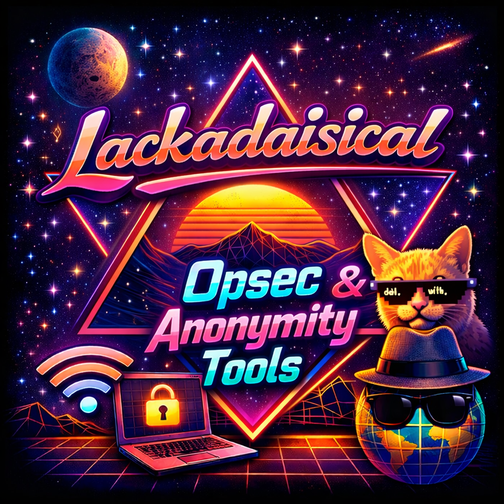

# Lackadaisical Anonymity Toolkit

<p align="center">
  
</p>

**By:** Lackadaisical Security  
**Website:** https://lackadaisical-security.com  
**Version:** 1.0.0

A comprehensive, modular anonymity toolkit for security professionals and privacy enthusiasts.

## Overview

The Lackadaisical Anonymity Toolkit provides a suite of tools for maintaining anonymity, privacy, and security across various platforms and use cases. Built with a focus on modularity, cross-platform compatibility, and ease of use.

## Features

### 🌐 Network Anonymization
- **Tor Integration**: Full Tor control with circuit management
- **DNS Privacy**: DNS-over-HTTPS with multiple providers
- **VPN Management**: Automated VPN configuration and chaining
- **Proxy Chains**: Multi-hop proxy configuration
- **Traffic Obfuscation**: Make VPN traffic look like HTTPS
- **MAC Spoofing**: Hardware address randomization

### 🔒 Data Security
- **Metadata Removal**: Clean EXIF and other metadata from files
- **Secure Deletion**: Multi-pass file shredding with verification
- **Encryption Tools**: File and communication encryption
- **Steganography**: Hide data in images, audio, and text
- **Anti-Forensics**: Defeat forensic analysis techniques
- **Data Anonymization**: K-anonymity, L-diversity, differential privacy

### 🎭 Identity Management
- **Pseudonym Generator**: Create realistic fake identities
- **Credential Manager**: Secure storage for multiple personas
- **Biometric Spoofing**: Generate synthetic biometric data
- **Browser Fingerprinting**: Spoof browser characteristics
- **Location Spoofing**: Fake GPS and network location

### 🛡️ System Protection
- **Process Hiding**: Hide processes from detection
- **Memory Analysis**: Detect malware and surveillance
- **Filesystem Monitor**: Detect unauthorized access
- **Activity Monitoring**: Real-time security alerts
- **Trace Removal**: Clean system logs and artifacts
- **Privacy Hardening**: System-wide security hardening

### 📡 Communication
- **Encrypted Messaging**: End-to-end encrypted chat
- **Anonymous Email**: Temporary email services
- **Secure File Transfer**: Encrypted file sharing
- **Covert Channels**: Hidden communication methods
- **Voice Anonymization**: Real-time voice changing
- **Stealth Communication**: DNS tunneling, HTTP headers, timing channels

### 🔍 Analysis Tools
- **Network Scanner**: Stealthy network reconnaissance
- **Traffic Analyzer**: Deep packet inspection
- **Digital Footprint**: Analyze privacy exposure
- **Memory Forensics**: Extract artifacts from RAM
- **Counter-Surveillance**: Detect monitoring attempts
- **Privacy Analytics**: Statistical privacy analysis with R

## Supported Languages & Implementations

The toolkit includes implementations in multiple programming languages:

- **Core (C/C++/Assembly)**: High-performance system operations
- **Python**: Main framework and most modules
- **Go**: Network tools and performance-critical components
- **Rust**: Memory-safe system utilities
- **JavaScript/TypeScript**: Web privacy tools and browser extensions
- **Ruby**: Scripting and automation tools
- **PowerShell**: Windows-specific utilities
- **PHP**: Web anonymization tools
- **.NET/C#**: Windows privacy utilities
- **Java**: Cross-platform GUI tools
- **Perl**: Text processing and legacy system support
- **Lua**: Lightweight scripting
- **Kotlin**: Android privacy tools
- **Swift**: iOS privacy tools
- **Bash**: System scripts and automation
- **Scala**: Privacy proxy and distributed systems
- **Elixir**: Distributed anonymizer network
- **Haskell**: Cryptographic tools
- **Clojure**: Data anonymization
- **R**: Statistical privacy analysis
- **Dart**: Mobile privacy shield
- **Julia**: Statistical privacy and differential privacy
- **Nim**: Stealth communication tools

## Installation

### Quick Install

```bash
git clone https://github.com/Lackadaisical-Security/Lackadaisical-Opsec-Anonymity-Tools.git
cd Lackadaisical-Opsec-Anonymity-Tools
pip3 install -r requirements.txt
chmod +x lackadaisical
./lackadaisical --list
```

### System Dependencies

**Debian/Ubuntu:**
```bash
sudo apt-get update
sudo apt-get install -y python3 python3-pip tor golang ruby nodejs npm \
    rustc perl lua5.3 openvpn wireguard-tools
```

**Fedora/RHEL:**
```bash
sudo dnf install -y python3 python3-pip tor golang ruby nodejs npm \
    rust perl lua openvpn wireguard-tools
```

**Arch Linux:**
```bash
sudo pacman -S python python-pip tor go ruby nodejs npm rust perl lua \
    openvpn wireguard-tools
```

**macOS:**
```bash
brew install python tor go ruby node rust perl lua openvpn wireguard-tools
```

### Python Dependencies

Install all required Python packages:
```bash
pip3 install -r requirements.txt
```

Core packages include:
- `cryptography` - Encryption and secure storage
- `stem` - Tor control 
- `dnspython` - DNS operations
- `requests` - HTTP requests
- `scapy` - Network packet manipulation
- `psutil` - System monitoring

### Optional Components

**Golang tools:**
```bash
cd modules/data
go build metadata_cleaner.go
```

**Rust tools:**
```bash
cd modules/traffic  
cargo build --release
```

**Ruby tools:**
```bash
gem install faker
```

## Quick Start

### 1. Test Your Privacy Status

```bash
# Check system privacy
./lackadaisical privacy-check

# Analyze digital footprint
./lackadaisical footprint-analyze --output footprint-report.txt

# Test for DNS leaks
./lackadaisical dns-leak-test
```

### 2. Setup Network Anonymity

```bash
# Start Tor
sudo systemctl start tor

# Control Tor circuit
./lackadaisical tor-control --new-identity

# Chain VPNs (requires root)
sudo ./lackadaisical vpn-chain start --providers mullvad proton --hops 2

# Full network anonymization
sudo ./lackadaisical anonymize --tor --vpn --dns-crypt
```

### 3. Manage Identities

```bash
# Initialize credential vault
./lackadaisical credential-vault init

# Generate fake identity
./lackadaisical pseudonym --full --with-backstory

# Add persona to vault
./lackadaisical credential-vault add john_doe --interactive
```

### 4. Secure Data

```bash
# Remove metadata from images
./lackadaisical metadata-clean *.jpg --recursive

# Secure file deletion (DoD 5220.22-M)
./lackadaisical secure-delete sensitive.txt --method dod7 --verify

# Hide data in image (steganography)
./lackadaisical steganography hide --cover photo.jpg --data secret.txt
```

### 5. Monitor System

```bash
# Real-time activity monitoring
sudo ./lackadaisical activity-monitor --real-time

# Detect surveillance
sudo ./lackadaisical counter-surveillance --full

# Monitor filesystem changes
./lackadaisical filesystem-monitor /path/to/watch
```

## Available Tools

### Network Anonymization (9 tools)

| Tool | Command | Description |
|------|---------|-------------|
| **Tor Controller** | `tor-control` | Manage Tor circuits, rotate identity, monitor connections |
| **DNS-over-HTTPS** | `dns-over-https` | Secure DNS with DoH support, multiple providers |
| **VPN Chain** | `vpn-chain` | Multi-hop VPN chaining for layered anonymity |
| **DNS Leak Tester** | `dns-leak-test` | Detect DNS leaks that compromise anonymity |
| **HTTPS Enforcer** | `https-enforce` | Enforce HTTPS connections, detect SSL/TLS issues |
| **Network Anonymizer** | `anonymize` | Automated multi-layer network anonymization |
| **Traffic Analyzer** | `traffic-analyze` | Deep packet inspection and traffic analysis |
| **Packet Injector** | `packet-inject` | Network packet manipulation and injection |
| **MAC Spoofer** | `mac-spoof` | Hardware address randomization |

### Data Security (5 tools)

| Tool | Command | Description |
|------|---------|-------------|
| **Metadata Cleaner** | `metadata-clean` | Remove EXIF and metadata from files |
| **Secure Shredder** | `secure-delete` | Military-grade file deletion (DoD, Gutmann methods) |
| **Password Generator** | `password-gen` | Cryptographically secure passwords & passphrases |
| **Steganography** | `steganography` | Hide data in images, audio, and files |
| **Secure Messenger** | `secure-messenger` | End-to-end encrypted messaging |

### Identity Management (4 tools)

| Tool | Command | Description |
|------|---------|-------------|
| **Pseudonym Generator** | `pseudonym` | Generate realistic fake identities |
| **Biometric Spoofer** | `biometric-spoof` | Generate synthetic biometric data |
| **Credential Vault** | `credential-vault` | Encrypted storage for multiple personas |
| **Browser Fingerprint Spoofer** | `browser-spoof` | Defeat browser fingerprinting |

### System Protection (5 tools)

| Tool | Command | Description |
|------|---------|-------------|
| **Activity Monitor** | `activity-monitor` | Real-time threat detection and monitoring |
| **Anti-Forensics** | `anti-forensics` | Defeat forensic analysis techniques |
| **Filesystem Monitor** | `filesystem-monitor` | Detect unauthorized file access |
| **Privacy Check** | `privacy-check` | System-wide privacy assessment |
| **Trace Removal** | `trace-remove` | Clean system logs and artifacts (Windows) |

### Analysis & OPSEC (4 tools)

| Tool | Command | Description |
|------|---------|-------------|
| **Digital Footprint Analyzer** | `footprint-analyze` | Comprehensive privacy exposure analysis |
| **Counter-Surveillance** | `counter-surveillance` | Detect surveillance devices and monitoring |
| **Memory Analyzer** | `memory-analyze` | Extract artifacts from RAM, detect malware |

**Total: 27 production-grade tools across 5 categories**

## Usage

### Command Line Interface

```bash
# List all available modules
lackadaisical --list

# Run specific module
lackadaisical <module> [options]

# Get help for a module
lackadaisical <module> --help
```

### Common Operations

#### Complete Anonymization
```bash
# Apply full anonymity configuration
sudo lackadaisical anonymize --full

# Paranoid mode (maximum security)
sudo lackadaisical anonymize --paranoid

# Custom layered approach
sudo lackadaisical anonymize --tor --vpn --proxy --dns-crypt
```

#### Identity Management
```bash
# Generate new identity
lackadaisical pseudonym

# Generate complete persona with backstory
lackadaisical pseudonym --full --with-backstory

# Generate biometric data
lackadaisical biometric-spoof --fingerprint --face --voice
```

#### Secure Communication
```bash
# Start encrypted messenger
lackadaisical secure-messenger username --listen

# Create anonymous email
lackadaisical anon-email create --provider guerrilla

# Setup covert channel
lackadaisical covert-channel dns --data "secret" --domain example.com
```

#### System Monitoring & Protection
```bash
# Check privacy status
lackadaisical privacy-check

# Monitor for threats
lackadaisical activity-monitor --real-time

# Detect surveillance
sudo lackadaisical counter-surveillance --full

# Emergency shutdown
sudo lackadaisical emergency --panic
```

#### Data Security
```bash
# Remove metadata from all images
lackadaisical metadata-clean *.jpg --recursive

# Secure delete with verification
lackadaisical secure-delete sensitive.txt --verify

# Hide data in image
lackadaisical stego hide --cover image.jpg --data secret.txt

# Anonymize dataset
lackadaisical data-anonymize dataset.csv --k-anon 5 --l-div 2
```

## Project Structure

```
Lackadaisical-Anonymity-Tools/
├── core/                    # Core libraries and utilities
│   ├── asm/                # Assembly implementations
│   ├── c/                  # C implementations
│   ├── cpp/                # C++ implementations
│   └── common/             # Shared headers and utilities
├── modules/                # Functional modules
│   ├── network/           # Network anonymization
│   ├── data/              # Data sanitization
│   ├── identity/          # Identity management
│   ├── traffic/           # Traffic obfuscation
│   ├── system/            # System hardening
│   ├── communication/     # Communication security
│   ├── forensics/         # Forensic analysis
│   └── opsec/             # Operational security
├── tools/                  # Standalone tools in various languages
│   ├── python/            # Python tools
│   ├── go/                # Go tools
│   ├── javascript/        # JavaScript tools
│   ├── ruby/              # Ruby tools
│   ├── powershell/        # PowerShell tools
│   ├── php/               # PHP tools
│   ├── dotnet/            # .NET/C# tools
│   ├── rust/              # Rust tools
│   ├── java/              # Java tools
│   ├── perl/              # Perl tools
│   ├── lua/               # Lua scripts
│   ├── kotlin/            # Kotlin tools
│   ├── swift/             # Swift tools
│   ├── bash/              # Bash scripts
│   ├── scala/             # Scala tools
│   ├── elixir/            # Elixir tools
│   ├── haskell/           # Haskell tools
│   ├── clojure/           # Clojure tools
│   ├── r/                 # R scripts
│   ├── dart/              # Dart tools
│   ├── julia/             # Julia tools
│   └── nim/               # Nim tools
├── scripts/               # Utility and deployment scripts
├── docs/                  # Comprehensive documentation
├── tests/                 # Test suites
├── config/                # Configuration files
└── lackadaisical          # Main launcher
```

## Key Components

### Core Modules

1. **Network Anonymizer** - Complete network privacy solution
2. **Tor Controller** - Advanced Tor network management
3. **DNS Privacy** - Secure DNS with DoH/DoT support
4. **Traffic Obfuscator** - Make traffic appear as normal HTTPS

### Identity Tools

1. **Pseudonym Generator** - Create complete fake identities
2. **Biometric Spoofer** - Generate synthetic biometric data
3. **Browser Spoofer** - Defeat browser fingerprinting
4. **Credential Manager** - Secure multi-persona management

### Security Tools

1. **Process Hider** - Hide processes from detection
2. **Anti-Forensics** - Defeat forensic analysis
3. **Secure Delete** - Military-grade data destruction
4. **Memory Cleaner** - Secure RAM wiping

### Communication

1. **Secure Messenger** - E2E encrypted messaging
2. **Anonymous Email** - Temporary email services
3. **Covert Channels** - Hidden communication methods
4. **Voice Scrambler** - Real-time voice anonymization

### Analysis & Monitoring

1. **Activity Monitor** - Real-time threat detection
2. **Digital Footprint Analyzer** - Privacy leak detection
3. **Memory Analyzer** - RAM forensics and malware detection
4. **Network Scanner** - Stealthy reconnaissance

## Documentation

- [Usage Guide](docs/USAGE_GUIDE.md) - Detailed usage instructions
- [API Reference](docs/API_REFERENCE.md) - Developer documentation
- [Security Guide](docs/SECURITY_GUIDE.md) - Security best practices
- [Contributing](docs/CONTRIBUTING.md) - How to contribute
- [Deployment Guide](docs/DEPLOYMENT.md) - Installation and configuration
- [Module Documentation](docs/modules/) - Detailed module docs

## Security Considerations

- **Legal Compliance**: Always comply with local laws and regulations
- **Ethical Use**: This toolkit is for legitimate security testing and privacy protection
- **No Warranties**: Use at your own risk, no guarantees provided
- **Verify Sources**: Always verify the integrity of downloaded tools
- **Operational Security**: Follow OPSEC best practices
- **Regular Updates**: Keep the toolkit updated for latest security fixes

## Performance

The toolkit is optimized for:
- **Low latency** network operations
- **Minimal resource usage** on constrained systems
- **High-throughput** data processing
- **Real-time** monitoring and analysis
- **Concurrent operations** for efficiency

## Platform Support

- **Linux**: Full support (recommended)
- **Windows**: Full support (some features require WSL2)
- **macOS**: Full support
- **BSD**: Core features supported
- **Mobile**: Android/iOS tools available
- **Embedded**: Lightweight modules for IoT devices

## Contributing

We welcome contributions! Please see our [Contributing Guide](docs/CONTRIBUTING.md) for details.

### Development Setup

```bash
# Clone repository
git clone https://github.com/lackadaisical-security/anonymity-toolkit
cd anonymity-toolkit

# Create virtual environment
python3 -m venv venv
source venv/bin/activate

# Install development dependencies
pip install -r requirements-dev.txt

# Run tests
python -m pytest tests/

# Run linters
./scripts/lint.sh
```

## Community

- **Forum**: https://forum.lackadaisical-security.com
- **IRC**: #lackadaisical on OFTC (Tor-friendly)
- **Matrix**: #lackadaisical:matrix.org
- **Reddit**: r/lackadaisical

## License

This project is licensed under the MIT License - see [LICENSE](LICENSE) file for details.

## Export Control and Compliance

### U.S. Export Control Notice

**IMPORTANT**: This software may be subject to U.S. export control laws and regulations, including the Export Administration Regulations (EAR) maintained by the U.S. Department of Commerce.

#### Cryptographic Software Notice

This repository contains cryptographic software and tools. The export, re-export, or transfer of this software may be restricted under U.S. law. The U.S. government classifies cryptographic software under Export Control Classification Number (ECCN) 5D002 on the Commerce Control List.

#### License Exception Available

Publicly available encryption source code may be exported under License Exception TSU (Technology and Software - Unrestricted) in accordance with 15 CFR § 740.13(e). However, users must still comply with notification requirements and restrictions on exports to certain countries and entities.

#### Country Restrictions

**Export, re-export, or transfer of this software is prohibited to the following countries and regions** (subject to change):

- Cuba
- Iran  
- North Korea (Democratic People's Republic of Korea)
- Syria
- Crimea, Donetsk, and Luhansk regions of Ukraine
- Any country or region subject to comprehensive U.S. sanctions

Additionally, exports to certain individuals and entities on the U.S. government restricted parties lists are prohibited, including:
- Denied Persons List (DPL)
- Entity List
- Specially Designated Nationals (SDN) List
- Unverified List (UVL)

#### User Responsibilities

**By downloading, accessing, or using this software, you represent and warrant that:**

1. You are not located in, under the control of, or a national or resident of any embargoed country
2. You are not listed on any U.S. government list of prohibited or restricted parties
3. You will not use this software for any purposes prohibited by U.S. law, including nuclear, chemical, or biological weapons proliferation, or missile technology development
4. You will comply with all applicable export control laws and regulations
5. You will not export, re-export, or transfer this software in violation of U.S. law

#### Additional Legal Compliance

Users are responsible for:
- Complying with all applicable laws in their jurisdiction
- Obtaining any necessary export licenses or approvals
- Understanding and adhering to end-use restrictions
- Monitoring changes to export control regulations
- Consulting with legal counsel regarding compliance obligations

#### Notification

This software has been made publicly available in accordance with U.S. export control regulations. The source code repository URL has been provided to the U.S. government as required.

For more information about U.S. export controls, visit:
- Bureau of Industry and Security (BIS): https://www.bis.doc.gov/
- Export Administration Regulations: https://www.bis.doc.gov/regulations/
- Encryption Export Controls: https://www.bis.doc.gov/encryption/

## Disclaimer

This toolkit is provided for educational and legitimate security testing purposes only. Users are solely responsible for complying with all applicable laws and regulations in their jurisdiction. The authors and contributors assume no liability for misuse or damage caused by this software.

**EXPORT CONTROL DISCLAIMER**: The authors and contributors make no representation regarding the applicability of export control laws to any specific use case and expressly disclaim any liability for violations of such laws. Users assume full responsibility for ensuring compliance with all applicable export control regulations.

## Support

- **Documentation**: https://docs.lackadaisical-security.com
- **Issues**: [GitHub Issues](https://github.com/lackadaisical-security/anonymity-toolkit/issues)
- **Discussions**: [GitHub Discussions](https://github.com/lackadaisical-security/anonymity-toolkit/discussions)
- **Security**: Report security issues to security@lackadaisical-security.com (PGP key available)
- **Commercial Support**: enterprise@lackadaisical-security.com

## Acknowledgments

Special thanks to:
- The Tor Project
- Electronic Frontier Foundation (EFF)
- The privacy and security research community
- All contributors and testers
- Open source projects we build upon

## Citations

If you use this toolkit in academic research, please cite:
```bibtex
@software{lackadaisical2024,
  title = {Lackadaisical Anonymity Toolkit},
  author = {Lackadaisical Security Team},
  year = {2025},
  url = {https://github.com/lackadaisical-security/anonymity-toolkit}
}
```

---

**Remember**: Privacy is a human right. Stay safe, stay anonymous.

*"In a world of surveillance, anonymity is not about having something to hide, but about having something to protect - your freedom."*
